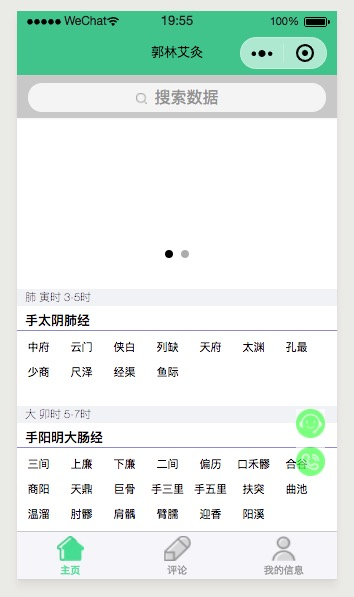
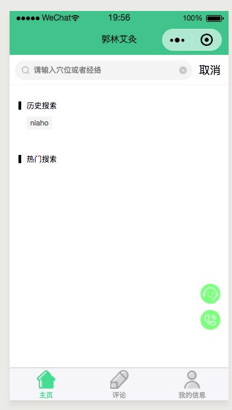
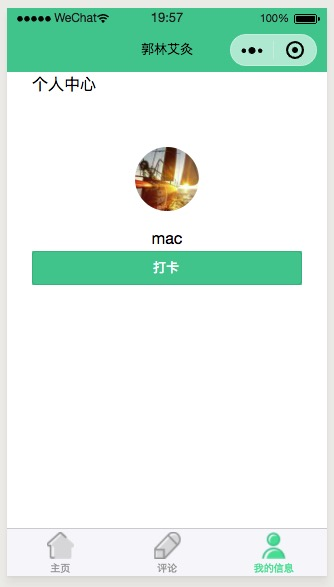

# aijiu

> 一个查询穴位经络的小程序，这个小程序使用的是mpvue2.x框架 mongodb数据库还有一些组件
  目前没有后台登录界面


## 界面
### 主界面

### 穴道详情

### 搜索界面

### 个人中心



## Build Setup

``` bash
# install dependencies
npm install

# serve with hot reload at localhost:8080
npm run dev

# build for production with minification
npm run build

# build for production and view the bundle analyzer report
npm run build --report
```

For detailed explanation on how things work, checkout the [guide](http://vuejs-templates.github.io/webpack/) and [docs for vue-loader](http://vuejs.github.io/vue-loader).

